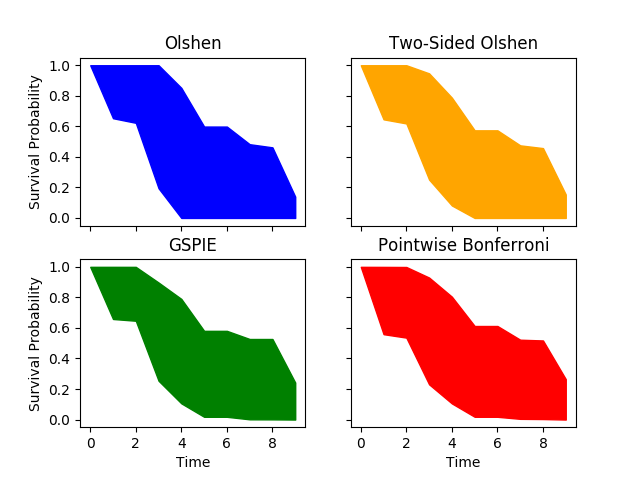
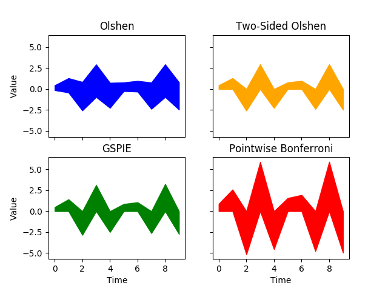
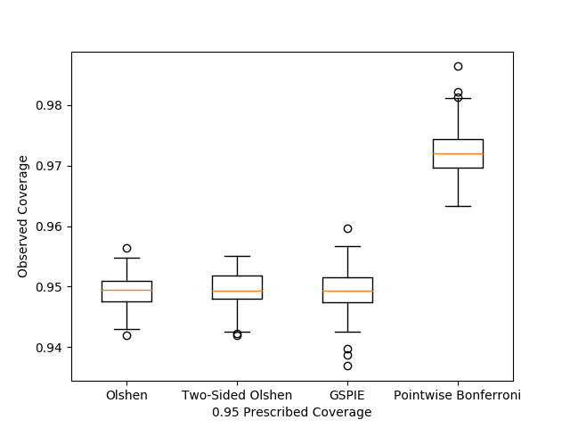
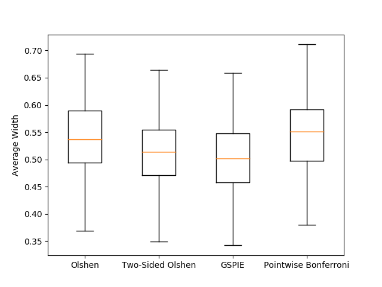
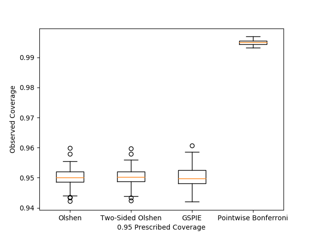
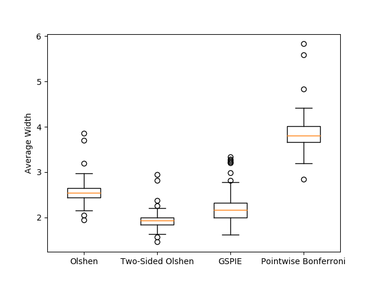

# spie
This respository implements several methods for sampled-based simultaneous prediction intervals estimation (SPIE).
Simultaneous prediction intervals (SPI) are a collection of intervals such that, given the observed information, with a prescribed probability, a future observation lies within *every* interval. The methods in this repository were examined in the context of patient-specific survival analysis in the paper *Simultaneous Prediction Intervals for Patient-Specific Survival Curves* but are applicable to any case in which it is possible to sample the distribution of interest. The images below show examples of SPI (with linear interpolation between the intervals) estimated by each method on synthetic survival data and synthetic time series data, respectively.
<p float="middle">
  
   
</p>

## Installation
This package is hosted on pypi. Install it with `pip install spie`.

## A Brief Overview of the Methods
### TLDR: The best performing method depends on the distribution, sample size, dimension, and validiation split.
<p float="middle">
  
  
</p>

<p align="center">
Performance on synthetic survival analysis data.
</p>

<p float="middle">
  
   
</p>

<p align="center">
Performance on synthetic time series data. 
</p>

Plots were generated with 10,000 points of dimension 10 and a 50/50 validation split for GSPIE.

* ### Olshen's Method
#### Olshen's method is reliably accurate and produces reasonably tight SPI.
Olshen's method was introduced in the paper *Gait Analysis and the Bootstrap* to estimate SPI for the gaits (manners of walking) of normal children. The SPI estimated by Olshen's method are centered around their respective mean values and have width proportional to their respective sample standard deviations. Bootstrapping is used to determine the constant of proportionality.

* ### Two-Sided Olshen's Method
#### Two-sided Olshen's method is comparably accurate to Olshen's method and typically produces SPI that are at least as tight as those produced by Olshen's method.
Two-sided Olshen's method is a small modification to Olshen's method that was introduced in the paper *Simultaneous Prediction Intervals for Patient-Specific Survival Curves*. At a high level, two-sided Olshen's method differs from Olshen's method in that it is not constrained to symmetric intervals.

* ### Greedy Simultaneous Prediction Interval Estimator (GSPIE)
#### GSPIE is generally less accurate than Olshen's method but achieves comparable accuracy in some cases. On certain distributions GSPIE produces tighter SPI than other methods.
GSPIE was also introduced in the paper *Simultaneous Prediction Intervals for Patient-Specific Survival Curves*. GSPIE differs significantly from Olshen's methods in that it works by doing direct optimization over the landscape of simultaneous intervals. It begins with intervals containing all observations and decreases their widths in a greedy manner, using a validation set as a stopping condition. GSPIE requires more computation than Olshen's methods and relies on an intelligent choice of validation split.

* ### Pointwise Bonferroni
#### Given enough samples such that the quantiles of the ogive do not severely overfit as pointwise intervals, Bonferroni will produce conservative SPI that are generally (though not always) looser than the other methods.
Pointwise Bonferroni is a baseline that estimates pointwise prediction intervals by the quantiles of the ogive (the empirical distribution with linear interpolation) with a Bonferroni correction. The Bonferroni correction is a method that combines pointwise intervals into simultaneous intervals in a manner that is guaranteed to be accurate or conservative. In practice, it often yields simultaneous intervals that are very conservative.

## Relevant References

```
Prediction Intervals:

https://en.wikipedia.org/wiki/Prediction_interval


Olshen's method:

@article{olshen1989,
    author = {Olshen, Richard A. and Biden, Edmund N. and Wyatt, Marilynn P. and Sutherland, David H.},
    doi = {10.1214/aos/1176347372},
    fjournal = {The Annals of Statistics},
    journal = {Ann. Statist.},
    month = {12},
    number = {4},
    pages = {1419--1440},
    publisher = {The Institute of Mathematical Statistics},
    title = {Gait Analysis and the Bootstrap},
    url = {https://doi.org/10.1214/aos/1176347372},
    volume = {17},
    year = {1989}
}


Two-sided Olshen's method and GSPIE:

@misc{sokota2019simultaneous,
    title = {Simultaneous Prediction Intervals for Patient-Specific Survival Curves},
    author = {Samuel Sokota and Ryan D'Orazio and Khurram Javed and Humza Haider and Russell Greiner},
    year = {2019},
    eprint = {1906.10780},
    archivePrefix = {arXiv},
    primaryClass = {cs.LG}
}


Bonferroni Correction:

https://en.wikipedia.org/wiki/Bonferroni_correction
```
